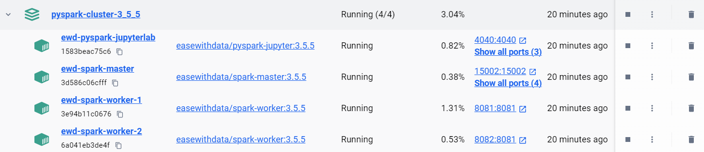
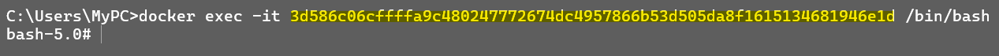
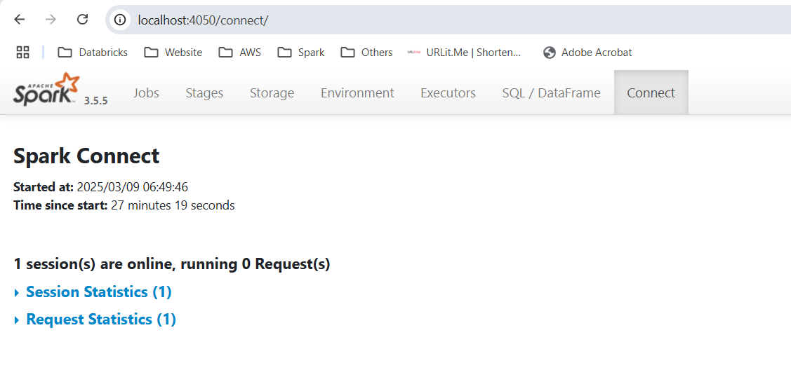
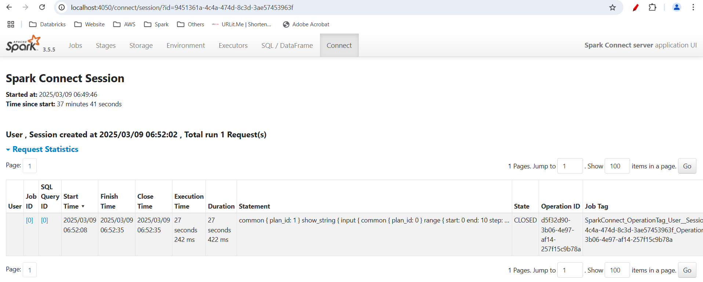

# Spark Cluster with Jupyter v3.5.5

**Apache Spark version 3.5.5** Cluster with 1 master, 2 worker nodes & PySpark Jupyter Lab.

### To setup the complete Cluster in docker
```shell
docker compose up
```

#### Spark Cluster with Jupyter on Docker


## Spark Connect
To start Spark Connect server, open terminal and run the following commands

```shell
docker exec -it <edw-spark-master container-id> /bin/bash
```




### 1. Run Spark Connect without Cluster
Once the terminal is connected to `edw-spark-master` container, run the following command to start Spark Connect Server

```shell
/spark/sbin/start-connect-server.sh --jars /spark/jars/spark-connect_2.12-3.5.5.jar --conf spark.ui.port=4050
```

####Note
- Spark Connect server starts on port `15002` with only driver. 
- The Spark UI for Spark Connect server is on port `4050` & can be accessed via `http://localhost:4050`.

### 2. Run Spark Connect on Cluster

Once the terminal is connected to `edw-spark-master` container, run the following command to start Spark Connect Server

```shell
/spark/sbin/start-connect-server.sh --jars /spark/jars/spark-connect_2.12-3.5.5.jar --master spark://0.0.0.0:7077 --total-executor-cores 4 --executor-cores 2 --conf spark.ui.port=4050
```



####Note
- Spark Connect server starts on port `15002` with **2 executors** and **2 cores** each. 
- The Spark UI for Spark Connect server is on port `4050` & can be accessed via `http://localhost:4050`.
- To change number of cores or executors, just change the parameter `--total-executor-cores` and `--executor-cores` in the above command.


## Code Example for Spark Connect
To run Spark code using Spark Connect use `remote` from SparkSession builder.
```python
from pyspark.sql import SparkSession

# Generate Spark Connect Session
spark = SparkSession\
    .builder\
    .remote("sc://localhost:15002")\
    .getOrCreate()

# Generate Dataframe using range
spark.range(10).show()
```




### References & Credits
1. **Ease With Data YouTube Channel (https://youtube.com/@easewithdata)**
2. Docker Image references - BDE2020 (https://hub.docker.com/u/bde2020)

### Maintainer
Ease With Data (easewithdata@gmail.com)