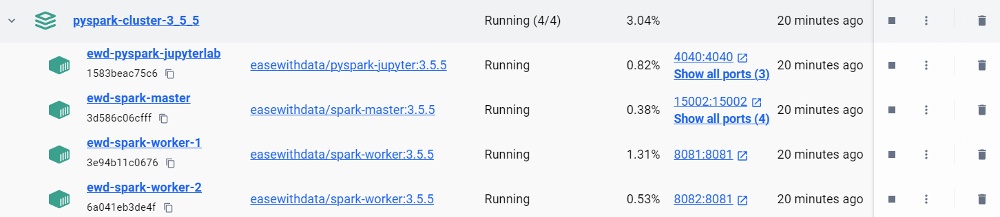
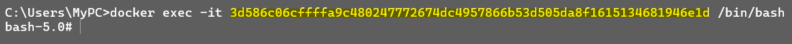
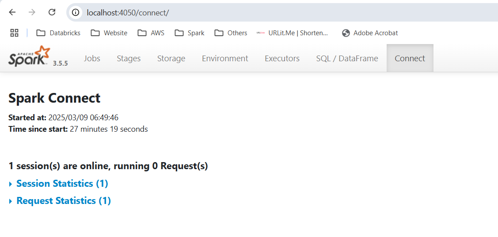
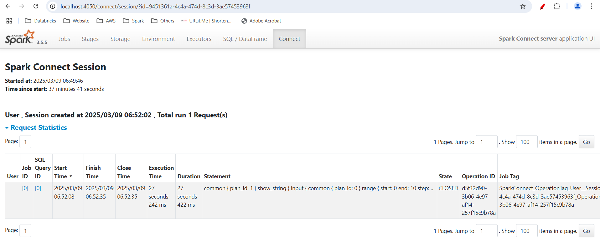

# Spark Cluster with Jupyter v3.5.5

**Apache Spark version 3.5.5** Cluster with 1 master, 2 worker nodes & PySpark Jupyter Lab.

### To setup the complete Cluster in docker
```shell
docker compose up
```

## Architecture support (Windows / Mac / Linux)

Docker images are Linux images regardless of your host OS -- Windows and macOS
both run them inside a Linux VM. What actually differs between machines is the
**CPU architecture**, not the operating system.

The `3.5.5` tag is `linux/amd64` only. On an Apple Silicon Mac (M1/M2/M3/M4) that
runs the JVM under emulation, which is slow and can make notebook kernels appear
to hang on "busy".

The `3.5.5_multi_arch` tag is published as a multi-architecture manifest and
Docker automatically pulls the right one:

| Machine | Architecture pulled |
|---|---|
| Windows on Intel/AMD | `linux/amd64` |
| Intel Mac | `linux/amd64` |
| Apple Silicon Mac | `linux/arm64` (native, no emulation) |
| Windows on ARM | `linux/arm64` |

To use it, point the image tags in `docker-compose.yml` at `3.5.5_multi_arch`.

Check what your machine actually pulled:
```shell
docker image inspect easewithdata/pyspark-jupyter:3.5.5_multi_arch --format '{{.Architecture}}'
```

### Rebuilding and publishing the images

```shell
./build-multiarch.sh           # build both architectures locally, no push
./build-multiarch.sh --push    # build and publish to Docker Hub
```

Note that `spark-master` and `spark-worker` build `FROM spark-base`, which buildx
resolves from the registry -- so `spark-base` has to be pushed before they can be
built. The script handles that ordering.

#### Note on pinned versions
The Python dependencies in `jupyter/Dockerfile` are pinned deliberately. Leaving
them unpinned lets `ipykernel` resolve to 7.x, which breaks the kernel in this
image (kernels stick on "busy" and the server eventually stops responding).
Please don't relax these pins without testing a notebook end to end.

#### Spark Cluster with Jupyter on Docker


## Spark Connect
To start Spark Connect server, open terminal and run the following commands

```shell
docker exec -it <edw-spark-master container-id> /bin/bash
```




### 1. Run Spark Connect without Cluster
Once the terminal is connected to `edw-spark-master` container, run the following command to start Spark Connect Server

```shell
/spark/sbin/start-connect-server.sh --jars /spark/jars/spark-connect_2.12-3.5.5.jar --conf spark.ui.port=4050
```

####Note
- Spark Connect server starts on port `15002` with only driver. 
- The Spark UI for Spark Connect server is on port `4050` & can be accessed via `http://localhost:4050`.

### 2. Run Spark Connect on Cluster

Once the terminal is connected to `edw-spark-master` container, run the following command to start Spark Connect Server

```shell
/spark/sbin/start-connect-server.sh --jars /spark/jars/spark-connect_2.12-3.5.5.jar --master spark://0.0.0.0:7077 --total-executor-cores 4 --executor-cores 2 --conf spark.ui.port=4050
```



####Note
- Spark Connect server starts on port `15002` with **2 executors** and **2 cores** each. 
- The Spark UI for Spark Connect server is on port `4050` & can be accessed via `http://localhost:4050`.
- To change number of cores or executors, just change the parameter `--total-executor-cores` and `--executor-cores` in the above command.


## Code Example for Spark Connect
To run Spark code using Spark Connect use `remote` from SparkSession builder.
```python
from pyspark.sql import SparkSession

# Generate Spark Connect Session
spark = SparkSession\
    .builder\
    .remote("sc://localhost:15002")\
    .getOrCreate()

# Generate Dataframe using range
spark.range(10).show()
```



#### Note
In case of issues, install the below python libraries before using Spark Connect
```
pip install pandas
pip install pyarrow
pip install grpcio
pip install protobuf
pip install grpcio-status
```

### References & Credits
1. **Ease With Data YouTube Channel (https://youtube.com/@easewithdata)**
2. Docker Image references - BDE2020 (https://hub.docker.com/u/bde2020)

### Maintainer
Ease With Data (easewithdata@gmail.com)